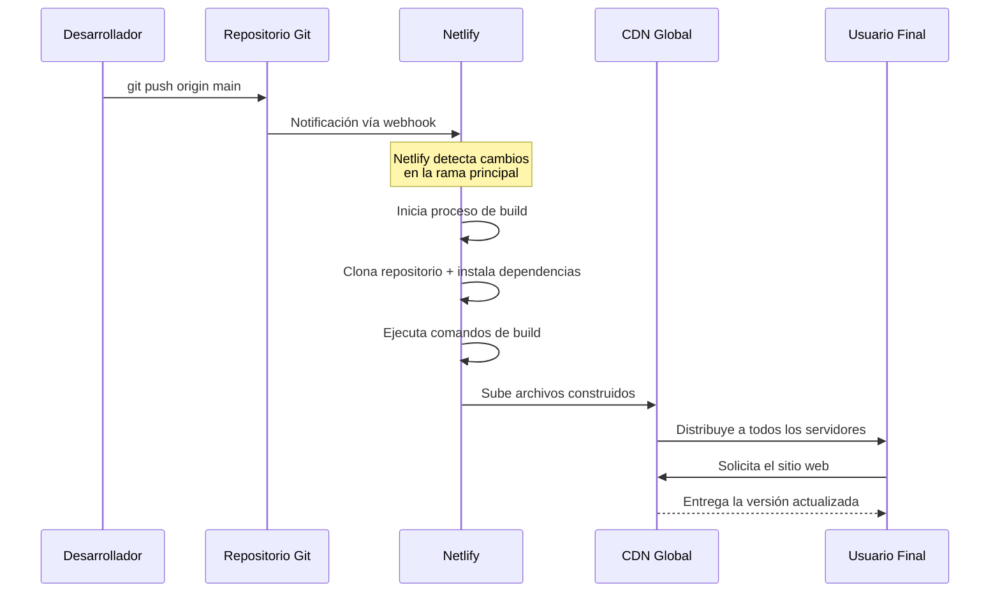

En el [post anterior]({{ page.previous.url }}) vimos cómo hacer un **deploy manual en Netlify**, subiendo los archivos directamente.
Ese método es útil para pruebas rápidas, pero **no es muy escalable**.

En este artículo veremos el **método recomendado en producción**, **deploy automático** desde un **repositorio Git**.

## ¿Por qué usar deploy desde repositorio?

A diferencia del deploy manual, este enfoque:

* Automatiza el despliegue
* Elimina errores humanos
* Mantiene historial de versiones
* Permite trabajar con ramas y PRs
* Se integra con flujos CI/CD

En Netlify, **Git es la fuente de la verdad**.

## Flujo de trabajo

El flujo de Netlify al usar un repositorio consiste en observar cambios a dicho repositorio y realizar un nuevo proceso de *build*.



- [x] No hay FTP.
- [x] No hay subir archivos a mano.
- [x] Todo ocurre automáticamente.

## Requisitos previos (asumidos)

Para llevar el proceso con éxito, se **asume que ya sabes**:

* Usar Git básico (`clone`, `commit`, `push`)
* Tener el proyecto funcionando localmente

## Paso 1: Crear sitio desde repositorio

1. Entra al dashboard de Netlify
2. **Add new site**
3. **Import an existing project**
4. Selecciona el proveedor:

   * GitHub
   * GitLab
   * Bitbucket

---

## 🔐 Paso 2: Autorización y selección del repo

Netlify pedirá acceso al proveedor Git.

Luego:

* Seleccionas el repositorio
* Eliges la rama principal (`main` o `master`)

📌 Netlify solo observa esa rama para producción.

---

## ⚙️ Paso 3: Configuración de build (clave)

Aquí defines **cómo se construye el sitio**.

### Ejemplo: Jekyll

| Campo             | Valor                      |
| ----------------- | -------------------------- |
| Build command     | `bundle exec jekyll build` |
| Publish directory | `_site`                    |

📌 Si no usas Bundler:

```bash
jekyll build
```

---

## 🧪 Detección automática

Netlify intenta detectar:

* Framework
* Comando de build
* Carpeta de salida

👉 **Nunca confíes ciegamente**: revisa y ajusta si es necesario.

---

## 🚀 Paso 4: Primer deploy automático

Al confirmar:

* Netlify clona el repo
* Ejecuta el build
* Publica el sitio
* Asigna una URL pública

```text
https://nombre-del-sitio.netlify.app
```

Este deploy queda registrado como **Production deploy**.

---

## 🔁 Deploy automático en cada push

A partir de ahora:

```bash
git push origin main
```

Provoca automáticamente:

1. Nuevo build
2. Nuevo deploy
3. Reemplazo del sitio anterior

📌 Sin tocar Netlify manualmente.

---

## 🌿 Deploy previews (Pull Requests)

Una de las funciones más potentes.

Cuando:

* Creas una rama
* Abres un Pull Request

Netlify genera automáticamente:

* Un deploy aislado
* Una URL temporal
* Logs independientes

Esto permite:
✔️ Revisar cambios
✔️ Validar contenido
✔️ Probar layouts

Antes de hacer merge.

---

## 📊 Historial y rollbacks

En **Deploys** puedes:

* Ver todos los deploys
* Revisar logs
* Restaurar una versión anterior

👉 El rollback es **instantáneo**.

---

## 📄 Configuración por código con `netlify.toml`

Para proyectos serios, se recomienda **versionar la configuración**.

Ejemplo:

```toml
[build]
  command = "bundle exec jekyll build"
  publish = "_site"

[context.production]
  environment = { JEKYLL_ENV = "production" }
```

Ventajas:

* Configuración reproducible
* Menos errores manuales
* Portabilidad total

---

## 🌎 Variables de entorno

Desde:
**Site settings → Environment variables**

Ejemplos comunes:

* `JEKYLL_ENV=production`
* API keys
* Flags de build

📌 Nunca hardcodees secretos en el repo.

---

## 🧯 Errores comunes en deploy Git

### ❌ Build falla

* Dependencias faltantes
* Ruby / Node incorrecto
* Comando mal escrito

### ❌ Sitio vacío

* Carpeta `publish` incorrecta
* Build no genera salida

### ❌ Cambios no aparecen

* Push en rama incorrecta
* Cache de build

---

## 🔄 Diferencia con deploy manual

| Deploy manual   | Deploy Git   |
| --------------- | ------------ |
| Subida directa  | Automatizado |
| Sin historial   | Versionado   |
| Riesgo de error | Reproducible |
| No escalable    | Profesional  |

📌 Deploy manual = prueba
📌 Deploy Git = producción

---

## 🏁 Conclusión

El deploy desde repositorio es **la forma correcta** de usar Netlify.

Te permite:

* Trabajar ordenadamente
* Automatizar despliegues
* Escalar el proyecto
* Integrarte a flujos CI/CD reales

Si ya dominaste el deploy manual, **este es el siguiente nivel**.

