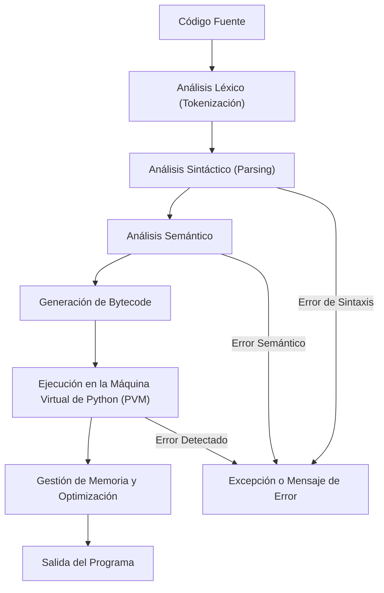

En este artículo, exploraremos qué es el **intérprete de Python**, cómo funciona y por qué es una pieza clave en la ejecución de programas creados en este lenguaje. También cubriremos (aunque no en profundidad) los diferentes tipos de intérpretes disponibles y cómo usarlos en **modo interactivo** o a través de **scripts**.

## ¿Qué es el Intérprete de Python?

El intérprete de Python es un software que se encarga de leer y ejecutar el código escrito en Python línea a línea, actúa como un traductor que convierte el código fuente en un formato comprensible para la máquina, pero en lugar de traducir todo el contenido de una vez (como haría un compilador), lo hace por fragmentos conforme se necesita, similar a un intérprete humano que traduce discurso por discurso en una conversación en lugar de todo un libro de una sola vez.

Cuando ejecutas instrucciones o un programa en Python, sigue estas etapas:

{: .light }
{: .dark }

### Etapa 1. Lectura del Código Fuente

El primer paso es cuando el intérprete de Python **recibe el código fuente**, que es el archivo con extensión `.py`. Este archivo contiene las instrucciones que el programador ha escrito en el lenguaje Python. En esta etapa, el intérprete simplemente carga el contenido del archivo en memoria para comenzar a procesarlo.

### Etapa 2. Compilación a Bytecode y Traducción en la PVM

Una vez el ecosistema de Python recibe el código fuente, el siguiente paso es **compilar** este código. La compilación no significa que el código se convierta en código máquina directamente (como en otros lenguajes como **C** o **JAVA**). El código es convertido a **bytecode**, que es un formato intermedio.

> El **bytecode** es más cercano al lenguaje máquina, pero aún no es directamente ejecutable.
{: .prompt-info }

Luego la **Python Virtual Machine** (PVM) interpreta y ejecuta el bytecode. 

### Etapa 3. Ejecución e Interacción

Luego que la **PVM** interpreta y ejecuta el bytecode, se comunica con el sistema para realizar acciones como mostrar texto en pantalla, leer archivos o acceder a la red.

Veamos nuevamente el flujo de este proceso (más detallado) en el siguiente diagrama:



En un lenguaje compilado por otra parte, el compilador lee el programa y lo traduce al mismo tiempo, antes de ejecutar cualquiera de las instrucciones. En este caso, al programa de alto nivel se le llama el **código fuente**, y al programa traducido el **código de objeto** o el **código ejecutable**. Una vez compilado el programa, puede ejecutarlo repetidamente sin volver a traducirlo.

## Modo Interactivo

En el **modo interactivo** de Python, podemos abrir una sesión en la que es posible ejecutar instrucciones directamente, realizar cálculos, operaciones y probar pequeños fragmentos de código y construir pequeños programas, pero una vez que se cierre la sesión interactiva no podemos reutilizar aquellos programas.

Para iniciar una sesión interactiva, basta con ejecutar el comando `python3` en la terminal:

```terminal
❯ python3
Python 3.13.2 (main, Feb 14 2025, 23:15:40) [Clang 14.0.0 (clang-1400.0.29.202)] on darwin
Type "help", "copyright", "credits" or "license" for more information.
>>>
```

> El símbolo `>>>` indica que Python está esperando una instrucción. Podemos escribir código y ver su resultado inmediatamente.
{: .prompt-info }

## Usando python como una calculadora

Como para abrir el apetito, antes de escribir grandes programas o desarrollar aplicaciones complejas, podemos empezar a jugar con Python de una manera sencilla, usándolo como una calculadora.

En su modo interactivo, Python resulta ser una potente calculadora que nos permite realizar desde operaciones matemáticas básicas hasta cálculos avanzados. Lo mejor es que los resultados se pueden ver de inmediato sin necesidad de escribir un programa completo.

### Operaciones básicas

Para probarlo, veamos algunas operaciones básicas:

```terminal
>>> 5 + 3 # Suma
8
>>> 10 - 4 # Resta
6
>>> 6 * 7 # Multiplicación
42
>>> 20 / 5 # División
4.0
```

> **Ojo** la división en Python siempre devuelve un número de punto flotante (o con decimal, si lo quieres ver de esa manera por ahora), incluso si el resultado es un número entero.
{: .prompt-info }

### División entera y módulo

Solo si queremos la parte entera de una división, usa `//`:

```terminal
>>> 20 // 3 # División entera
6
```

Para obtener el residuo de una división, usamos el `%`:

```terminal
>>> 20 % 3 # Módulo
2
```

### Potencias y raíces

Elevar un número a una potencia es muy fácil con `**`:

```terminal
>>> 2 ** 3 </span> # 2 elevado a la 3
8
```

También podemos calcular raíces cuadradas usando exponentes fraccionarios:

```terminal
>>> 16 ** 0.5 # Raíz cuadrada de 16
4.0
```

Para funciones matemáticas más avanzadas, tenemos un módulo especializado `math`:

```python
>>> import math # importar el módulo
>>> math.sqrt(25) # Raíz cuadrada de 25
5.0
>>> math.pow(2, 3) # 2 elevado a la 3
8.0
>>> math.log(100, 10) # Logaritmo en base 10 de 100
2.0
```
{: .nolineno }

> Por ahora, completa los ejemplos y experimenta con el modo interactivo. En los próximos posts, profundizaremos en temas más avanzados, como los **módulos**, **variables**, etc.
{: .prompt-info }

## Modo Scripts

El **modo scripts** se usa cuando se necesita ejecutar programas completos almacenados en archivos `.py`. El script se guarda y ejecuta desde una Terminal o símbolo del sistema, resultando en la ejecución del programa y la impresión del resultado en pantalla.

---

Como hemos visto, Python en su **modo interactivo** es una potente herramienta para experimentar, aprender y probar ideas de manera rápida y eficiente. Ya sea que estés trabajando con cálculos simples o explorando conceptos más complejos, este modo te permite interactuar directamente con el lenguaje y ver los resultados de inmediato.

A medida que avanzamos en los siguientes posts, profundizaremos en temas más avanzados, que te permitirán organizar y reutilizar tu código de manera más eficiente. No te detengas aquí.

¡Sigue explorando, aprendiendo y divirtiéndote con Python! ✌️