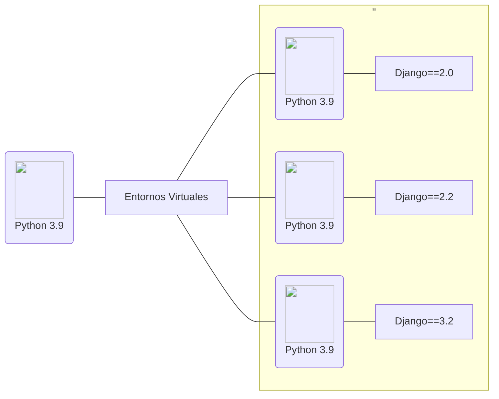

> Los desarrolladores experimentados suelen configurar y ejecutar sus aplicaciones en [entornos virtuales Python](https://docs.python.org/es/3/tutorial/venv.html){:target='blank'} de Python, lo que les permite trabajar de forma independiente y evitar conflictos entre proyectos.
{: .prompt-tip }

## ¿Qué es un entorno virtual?

Un entorno virtual en Python es una instancia aislada de un entorno de Python ya instalado. Su principal ventaja es que permite trabajar de forma ordenada en un proyecto específico, utilizando únicamente los módulos y librerías necesarios para ese caso, sin afectar a otros proyectos ni a la instalación global del sistema.

En la siguiente ilustración se muestra un ejemplo de cómo luce un entorno virtual, lo que nos ayudará a comprender mejor su funcionamiento.



## Comenzar a configurar entornos virtuales

Cuando instalamos [Python3](https://www.python.org/){:target='blank'} obtenemos un único entorno global que es compartido por todos los proyectos y todo el código de Python. Si bien podríamos instalar  **Django** para trabajar y otros paquetes en el entorno global. Sin embargo sólo podríamos tener instalada esa única versión en particular de cada paquete.

> Las aplicaciones Python instaladas en el entorno global pueden entrar en conflicto potencialmente unas con otras (Ej. si dependen de diferentes versiones del mismo paquete).
{: .prompt-warning }


Si instalamos Django dentro del entorno por defecto/global sólo podrás apuntar a una sóla versión de Django en la computadora. Esto puede ser un problema si quieres crear en el futuro nuevos sitios (usando las útilmas versiones de Django) pero manteniendo los sitios web que dependen de versiones más antiguas.


## Instalación de Software para crear entorno virtual

Después de instalar Python y pip, procedemos a instalar [virtualenvwrapper](https://virtualenvwrapper.readthedocs.io/en/latest/) (que incluye virtualenv) usando pip3:

```bash
sudo pip3 install virtualenvwrapper
```
{: .nolineno }

A continuación se añade las siguientes líneas en el archivo de inicio del shell (éste es un archivo oculto `.bashrc` o `.zshrc` si usas [zsh](https://en.wikipedia.org/wiki/Z_shell))

```bash
export WORKON_HOME=$HOME/.virtualenvs
export VIRTUALENVWRAPPER_PYTHON=/usr/bin/python3
export PROJECT_HOME=$HOME/Devel
source /usr/local/bin/virtualenvwrapper.sh
```
{: .nolineno file=".bashrc" }

  1.  La variable `WORKON_HOME` determina en qué directorio se deben crear los entornos virtuales de Python.
  
  2. Por último, se debe agregar esta línea al archivo `~/.bashrc` para especificar en dónde está ubicado el ejecutable de virtualenvwrapper.

### Cómo crear entornos virtuales

Se debe ejecutar el comando `mkvirtualenv` más el nombre del entorno virtual Python que queremos crear:

```bash
mkvirtualenv nombre_entorno
```
{: .nolineno }

### Cómo activar un entorno virtual

Para activar un virtualenv con Virtualenvwrapper solamente se necesita ejecutar el comando `workon` más el nombre del virtualenv en la terminal:

```bash
workon django-test
```
```bash
created virtual environment CPython3.9.2.final.0-64 in 9185ms
  creator CPython3Posix(dest=/home/enidev911/.virtualenvs/django-test, clear=False, no_vcs_ignore=False, global=False)
  seeder FromAppData(download=False, pip=bundle, setuptools=bundle, wheel=bundle, via=copy, app_data_dir=/home/enidev911/.local/share/virtualenv)
    added seed packages: pip==24.1, setuptools==70.1.0, wheel==0.43.0
  activators BashActivator,CShellActivator,FishActivator,NushellActivator,PowerShellActivator,PythonActivator
virtualenvwrapper.user_scripts creating /home/enidev911/.virtualenvs/django-test/bin/predeactivate
virtualenvwrapper.user_scripts creating /home/enidev911/.virtualenvs/django-test/bin/postdeactivate
virtualenvwrapper.user_scripts creating /home/enidev911/.virtualenvs/django-test/bin/preactivate
virtualenvwrapper.user_scripts creating /home/enidev911/.virtualenvs/django-test/bin/postactivate
virtualenvwrapper.user_scripts creating /home/enidev911/.virtualenvs/django-test/bin/get_env_detail
```
{: .nolineno .noheader }

### Cómo eliminar entornos virtuales

Al ejecutar el comando `rmvirtualenv` más el nombre del virtualenv, virtualenvwrapper se encarga de borrar el virtualenv con todas los paquetes que hayamos instalado en él:

```bash
rmvirtualenv nombre_entorno
```

## ¿Qué es Pipenv?

[Pipenv](https://pipenv-es.readthedocs.io/es/latest/){: target='_blank'} es una gran herramienta que administra entornos virtuales que destaca de las otras introduciendo otras características mucho más flexibles.

Automáticamente crea y maneja un entorno virtual para tus proyectos, también como *agregar/remover* paquetes desde tu archivo **Pipfile.lock**, que es usado para producir un determinado build.

Pipenv está destinado principalmente a proporcionar a usuarios y desarrolladores de aplicaciones un método sencillo para configurar un entorno de trabajo.

Por defecto, **Pipenv** guarda todos sus entornos virtuales en un solo lugar. Usualmente esto no es un problema, pero si te gustaría cambiarlo para comodidad de desarrollo, o si esta causando *issues* en servidores de construcción puedes setear la variable de entorno **`PIPENV_VENV_IN_PROJECT`** para crear un entorno virtual dentro de la raíz de tu proyecto.

Por defecto, Pipenv inicializará un proyecto usando cualquier versión de python que tenga python3. Además de iniciar un proyecto con las banderas `--three` o `--two`, también puedes setear la variable `PIPENV_DEFAULT_PYTHON_VERSION` para especificar cual versión usa cuando se inicie un proyecto.

### Instalación

**Versión requerida de Python:** 
- [{:height='25'}](https://www.python.org/)
{:style='list-style: none'}

**Página en pipy:** 
- [{:height='25'}](https://pypi.org/project/pipenv/)
{:style='list-style: none'}

En la terminal con el siguiente comando, procedemos a la instalación:

```bash
pip install --user pipenv
```
{: .nolineno }

> Esto se hace para prevenir romper cualquier paquete de sistema. Si **pipenv** no esta disponible en tu shell después de la instalación, vas a necesitar agregar la carpeta raiz de binarios del usuario a tu **PATH** en mi caso (*windows*) `C:\Users\home\AppData\Roaming\Python\Python38\Scripts`
{: .prompt-info }

### Instalación con Homebrew

Debes tener instalado [Homebrew](https://brew.sh/){: target='_blank' }, luego ejecuta el siguiente comando en el terminal:

```bash
brew install pipenv
```
{: .nolineno }

Para actualizarlo en cualquier momento, puedes ejecutar el siguiente comando:

```bash
brew upgrade pipenv
```
{: .nolineno }

### Administrar entornos virtuales con Pipenv

Crea un entorno virtual con la versión 3 de Python:

```bash
pipenv install --three
```
{: .nolineno }

Crea un entorno virtual con la versión 2 de Python (debe tener instalado en su sistema python 2.x)

```bash
pipenv install --two
```
{: .nolineno }

Activar un entorno virtual (si no existe, lo crea en el directorio actual) 

```bash
pipenv shell
```
{: .nolineno }

Salir del entorno virtual previamente activado:

```bash
exit
```
{: .nolineno }

Instalar paquetes:

```bash
pipenv install requests
```
{: .nolineno }

Eliminar un paquete o eliminar todos los paquetes:

```bash
pipenv uninstall django
pipenv uninstall --all
```
{: .nolineno }

Ejecutando un script usando pipenv run:

```bash
pipenv run python main.py
```
{: .nolineno }

Para evitar escribir el comando tan largo podemos activar el entorno virtual simplemente y luego ejecutar el script: 

```bash
pipenv shell
python main.py
```
{: .nolineno }

Instalar las dependencias de un archivo **Pipfile**:

```bash
pipenv install
```
{: .nolineno }

### Ejemplo de Pipfile & Pipfile.lock

Ejemplo de `Pipfile`:

```c
[[source]]
url = "https://pypi.org/simple"
verify_ssl = true
name = "pypi"

[dev-packages]

[packages]
django = "*"

[requires]
python_version = "3.7"
```
{: .nolineno file="Pipfile" }

- `[source]`: nos muestra el enlace de donde se descargan los paquetes.
- `[dev-packages]`: aquí se registran las librerías solo para desarrollo.
- `[packages]`: aquí se registran todos los paquetes requeridos para el proyecto, cuando instalemos los paquetes con el comando *pipenv install* .


Ejemplo de `Pipfile.lock`:

```json
{
    "_meta": {
        "hash": {
            "sha256": "7e7ef69da7248742e869378f8421880cf8f0017f96d94d086813baa518a65489"
        },
        "pipfile-spec": 6,
        "requires": {
            "python_version": "3.7"
        },
        "sources": [
            {
                "name": "pypi",
                "url": "https://pypi.org/simple",
                "verify_ssl": true
            }
        ]
    },
    "default": {},
    "develop": {}
}
```
{: .nolineno file="Pipfile.lock" }

### Recomendaciones generales & control de versiones

- Generalmente, mantén a ambos **Pipfile** y **Pipfile.lock** en tu control de versión.
- No mantengas **Pipfile.lock** en tu control de version si estas usando multiples versiones de Python
- Especifica tu versión de Python en la sección `[requires]` de tu **Pipfile**. En resumen, deberias tener solo una versión de Python, como herramienta de desarrollo.
- Siempre utiliza *pipenv install* para que se agregue a la lista de `[packages]` en el **Pipfile**.