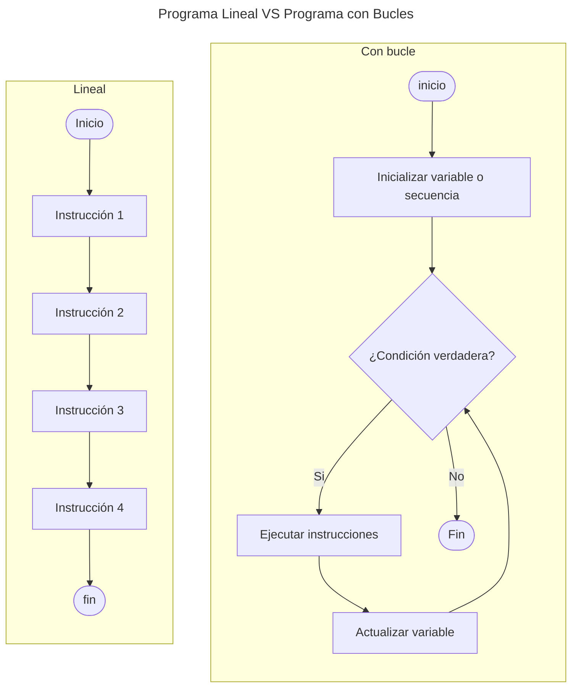
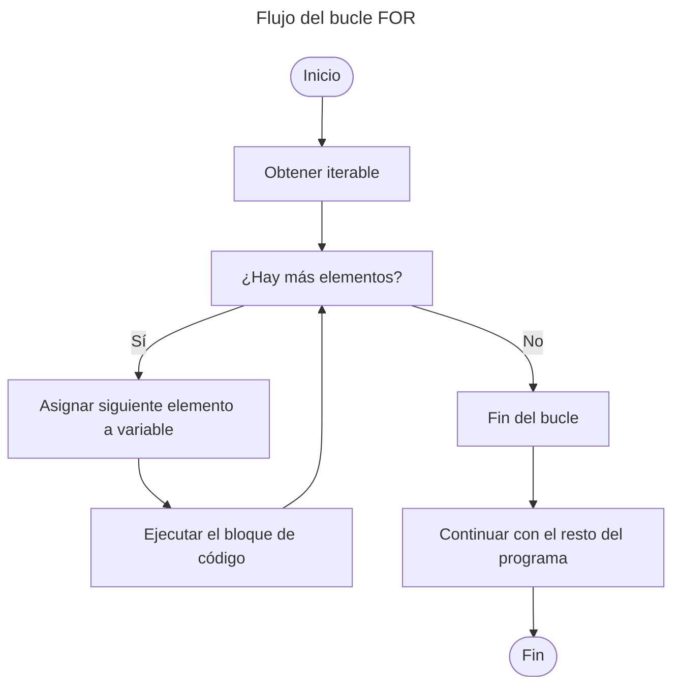

Por lo general, el código en Python se ejecuta de manera secuencial, es decir, empieza por la primera línea, pasa a la segunda y así sucesivamente. Sin embargo, existen casos, cuando __se necesita que un fragmento de código se repita__. Python y en general el mundo de la programación cuentan con las herramientas llamadas __bucles__ para facilitar esta tarea. Los bucles permiten cambiar el flujo lineal del programa para repetir una parte del código tantas veces como sea necesario.

## Tipos de bucles

En Python, hay dos tipos principales de bucles: el __bucle `for`__ y el __bucle `while`__. Ambos nos permiten controlar el flujo de un programa, pero de diferentes maneras.

### Bucle __while__

Un __bucle `while`__ se ejecuta __mientras una condición sea verdadera__. Esto significa que el código dentro del bucle se repetirá __tantas veces como sea necesario__, hasta que la condición deje de cumplirse.

### ¿Cómo funciona el bucle WHILE?

Para entender como funciona un flujo de un __programa lineal__ y un flujo con __bucle `while`__ de forma visual, pues aquí te dejo un diagrama que muestra ambos flujos:



> Un error común cuando se usa `while` es __olvidar inicializar o actualizar adecuadamente la variable que controla la condición__. Si la condición nunca cambia a __`False`__, el bucle se __ejecutará indefinidamente__, generando lo que se conoce como __bucle infinito__.
{: .prompt-warning }

__Ejemplo Básico__:

Veamos cómo usar `while` para hacer una cuenta regresiva:

```python
i = 5

while i > 0:
  print(i)
  i -= 1
  print("¡Booom!")
```
{:.typing}

> La operación `i -= 1` es lo que suele llamar un __decremento de una variable__. Es equivalente a `i = i - 1` y por ende es muy común simplificarlo, aunque hace exactamente lo mismo.
{: .prompt-info }

Lo que ocurre a la hora de hacer funcionar este código es lo siguiente:


&gt;&gt;&gt; i = 5
... <span class="hl">while i > 0:</span>
...   print(i)
...   i -= 1
... <span class="hl">print("¡Booom!")</span>
... 
5
4
3
2
1
¡Booom!



- Antes de entrar en el **bucle** `while`, se inicializa la variable `i` en `5`.
- Antes de realizar la primera **iteración** del bucle, **comprobamos la condición**.
- Si la **condición es verdadera**, hacemos lo que está dentro del bucle.
- Mostramos por pantalla el valor de `i` y luego
**decrementamos el valor** actual de `i` en `1`.
- Volvemos al **inicio del bucle** para hacer **una nueva iteración**. Comprobamos de nuevo la condición del bucle.
- Cuando **la condición sea falsa**, salimos del bucle y se muestra por pantalla **¡Boom!**.

Un **bucle** `while` es muy simple, pero requiere que declaremos una variable previamente y actualizar su valor para evaluar y evitar que el programa se quede colgado en un **bucle infinito**.

### Bucle __for__

A diferencia del __bucle `while`__, que se repite mientras se cumpla una condición lógica, el __bucle `for`__ se utiliza para __recorrer una colección o secuencia de elementos__.

Estas secuencias pueden ser estructuras ordenadas como listas, tuplas o cadenas de texto y cualquier __objeto iterable__, como diccionarios, conjuntos, o incluso objetos personalizados.

### ¿Cómo funciona el bucle FOR?

Ahora veamos cómo funciona internamente a través de un flujo de ejecución.



__Ejemplo básico__:

1\. Podemos imprimir el valor de la variable de iteración utilizando el bucle `for`:

```python
for i in [1, 2, 3, 4, 5]:
  print("Valor de i:", i)
```
{:.typing}

Resultado:


<span class="hl">&gt;&gt;&gt; for i in [1, 2, 3, 4, 5]:</span>
... print("Valor de i:", i)
... 
El valor de i: 1
El valor de i: 2
El valor de i: 3
El valor de i: 4
El valor de i: 5



2\. En algunos casos, __si la variable de control no se va a utilizar en el cuerpo del bucle__, es común utilizar un guión bajo (`_`) en vez de un nombre:

```python
for _ in [1, 2, 3, 4, 5]:
  print("Hola")
```
{:.typing}

Resultado:


&gt;&gt;&gt; for <span class="hl">_</span> in [1, 2, 3, 4, 5]:
... print("Hola")
...
Hola
Hola
Hola
Hola
Hola



> __El `_` es solo una notación__ que no tiene ninguna consecuencia con respecto al funcionamiento del programa, pero sirve de ayuda a la persona que esté leyendo el código fuente, que sabe así que los valores no se van a utilizar
{: .prompt-info }


En los ejemplos anteriores, la variable de control no se le ha dado un uso relevante aparte de mostrar su valor, pero en muchos casos sí se utiliza para realizar alguna otra operación.

3\. Elevar al cuadrado cada valor dentro de la lista operando con la variable de iteración:

```python
for i in [3, 4, 5]:
  print(f"Hola. Ahora i vale {i} y su cuadrado es {i ** 2}")
```
{:.typing}

Resultado:


&gt;&gt;&gt; for i in [3, 4, 5]:
... <span class="hl">print(f"Hola. Ahora i vale {i} y su cuadrado es {i ** 2}")</span>
...
Hola. Ahora i vale 3 y su cuadrado es 9
Hola. Ahora i vale 4 y su cuadrado es 16
Hola. Ahora i vale 5 y su cuadrado es 25


