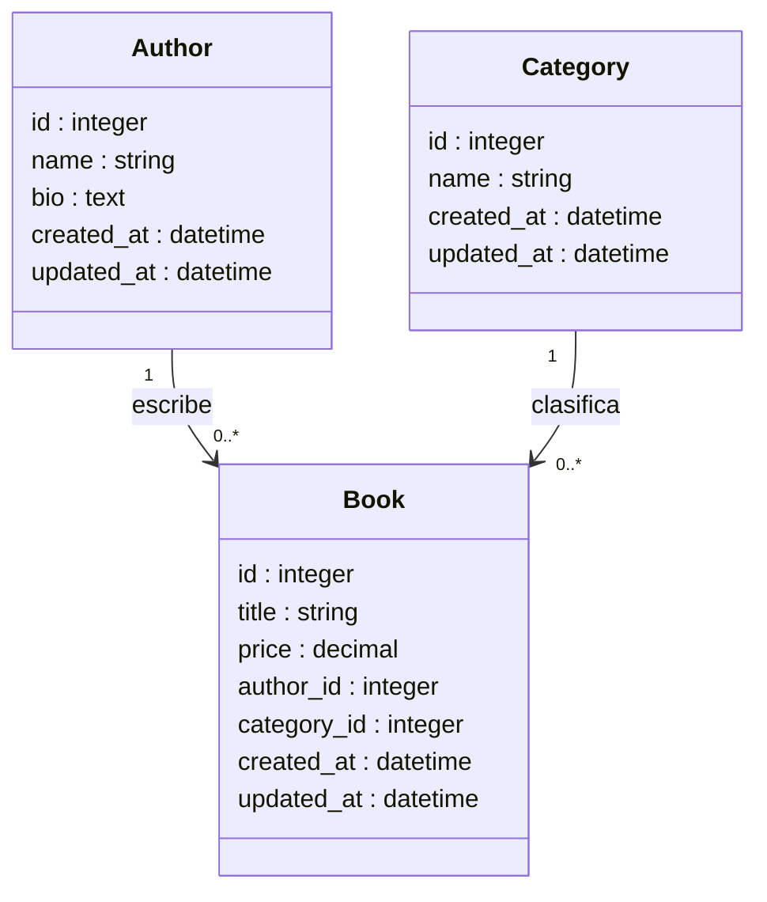

El ORM de Ruby on Rails se llama **Active Record**, y es una de las partes más poderosas del framework. Gracias a él puedes trabajar con bases de datos usando **objetos Ruby**, sin escribir SQL manual (aunque puedes hacerlo cuando lo necesites).

En este post construiremos un ejemplo simple usando el ORM, donde gestionaremos libros, autores y categorías. Veremos cómo crear el proyecto, configurar la base de datos, generar modelos, migrar tablas y realizar consultas típicas.

## ¿Qué es Active Record?

Active Record es la capa del MVC encargada de **gestionar los datos**. Cada tabla de la base de datos se representa como una **clase Ruby**, y cada fila como un **objeto**.

Ejemplo:  
La tabla `users` corresponde al modelo:

```ruby
class User < ApplicationRecord
end
````
{: .nolineno .typing }

## 1. Setup Rails

Para comenzar con el setup de Rails, lo primero es preparar el entorno y crear un nuevo proyecto.



  


  


  



Comprobamos la creación de la base de datos:

{:.light w="750" .rounded .border .bg-secondary-subtle}
{:.dark w="750" .rounded .border .bg-secondary}

## 2. Crear los modelos

En el proyecto __bookstore__ se definen tres modelos principales que conforman la base del dominio de la aplicación:

- `Book`: representa el libro.
- `Author`: representa un autor.
- `Category`: representa una categoría literaria.

Estas relaciones y atributos se encuentran representados en el siguiente diagrama de clases:



```terminal
rails generate model Author name:string bio:text
rails generate model Category name:string
rails generate model Book title:string price:decimal author:references category:references
```
{: .typing }

Rails generará:

* Los modelos dentro de `app/models/`
* Las migraciones dentro de `db/migrate/`

{:.dark .rounded .border .bg-secondary}
{:.light .rounded .border .bg-secondary-subtle}
_Modelos_

En la imagen se observa la **definición de los modelos del proyecto y sus relaciones** dentro de una aplicación con Rails:

* **Author** y **Category** son modelos base que heredan de `ApplicationRecord` y representan entidades independientes del sistema.
* **Book** es el modelo central y establece relaciones mediante `belongs_to` con **Author** y **Category**, lo que indica que **cada libro está asociado a un autor y a una categoría**.
* Esta estructura refleja una relación **uno a muchos**, donde un autor puede tener varios libros y una categoría puede agrupar múltiples libros.

{:.dark .rounded .border .bg-secondary}
{:.light .rounded .border .bg-secondary-subtle}
_Migraciones_

En la imagen se muestra la **definición de las migraciones de base de datos del proyecto**:

* Se observan las migraciones para **Author**, **Category** y **Book**, encargadas de crear las tablas correspondientes en la base de datos.
* Las tablas **authors** y **categories** contienen atributos básicos como `name` y marcas de tiempo (`timestamps`).
* La tabla **books** incluye atributos propios (`title`, `price`) y referencias (`author` y `category`) con **claves foráneas**, asegurando la integridad referencial.
* Esta configuración refleja a nivel de base de datos las relaciones definidas previamente en los modelos.


## 3. Aplicar las migraciones

Usando el comando `rails db` ejecutas la migración:

```terminal
rails db:migrate
```

{:.dark w="800" .rounded .border .bg-secondary}
{:.light w="800" .rounded .border .bg-secondary}

## 4. Relacionar los modelos con Active Record

Rails ya conoce las relaciones gracias a `references`, pero las debemos declarar en los modelos.

### `app/models/author.rb`

```ruby
class Author < ApplicationRecord
  has_many :books
end
```
{:file="app/models/author.rb"}

### `app/models/category.rb`

```ruby
class Category < ApplicationRecord
  has_many :books
end
```
{:file="app/models/category.rb"}

### `app/models/book.rb`

```ruby
class Book < ApplicationRecord
  belongs_to :author
  belongs_to :category
end
```
{:file="app/models/book.rb"}

Con esto Active Record genera métodos automáticos como:

* `author.books`
* `category.books`
* `book.author`
* `book.category`

## 5. Probando Active Record en la consola (Rails Console)

Podemos interactuar con nuestra base de datos desde:

```terminal
rails console
```

### Crear registros

```ruby
a = Author.create(name: "Gabriel García Márquez")
c = Category.create(name: "Realismo Mágico")

Book.create(
  title: "Cien años de soledad",
  price: 15000,
  author: a,
  category: c
)

# o de forma más controlada:
book = Book.new(title: "El pistolero", price: 20000, author: c, category: cS)
user.save
```
{:.nolineno}

### Consultar registros

```ruby
Book.first
Book.where(price: 10000..30000)
Author.find_by(name: "Gabriel García Márquez").books
```
{:.nolineno}

### Actualizar

```ruby
book = Book.first
book.update(price: 21.99)
```
{:.nolineno}


### Eliminar

```ruby
Book.last.destroy
```
{:.nolineno}

## 6. Controladores y rutas (rápido)

Si quieres exponer libros en una API o vistas:

```terminal
rails generate controller Books index show
```

En `config/routes.rb`:

```ruby
resources :books
```
{:.nolineno file="config/routes.rb"}

En `app/controllers/books_controller.rb`:

```ruby
class BooksController < ApplicationController
  def index
    @books = Book.includes(:author, :category)
  end

  def show
    @book = Book.find(params[:id])
  end
end
```
{:file="app/controllers/books_controller.rb"}

Rails ya te da las rutas REST:

* `/books`
* `/books/:id`




Rails hace que trabajar con una base de datos en un proyecto sea totalmente natural gracias a __Active Record__. Cada modelo se convierte en una clase Ruby completamente integrada con la base de datos, y las migraciones nos permiten evolucionar la estructura sin dolores de cabeza.

En este pequeño ejemplo ya logramos:

* Crear el proyecto *bookstore*
* Configurar la base de datos
* Definir modelos y relaciones
* Migrar tablas
* Hacer consultas con Active Record
* Preparar controladores y rutas básicas
