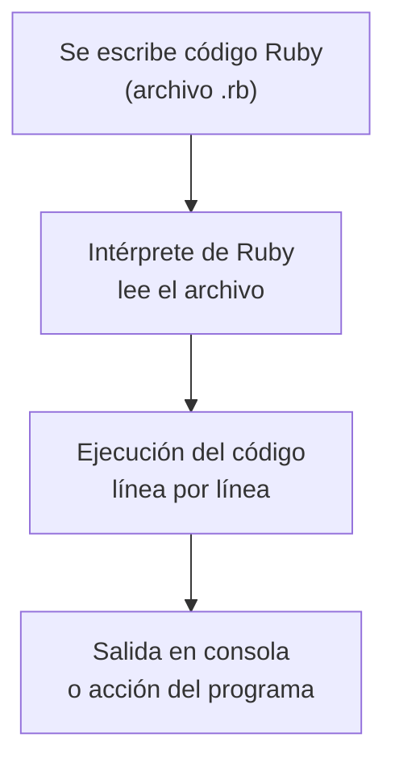

Ruby es un lenguaje de programación multiplataforma, __interpretado__, __orientado a objetos__ y de __alto nivel__. Ruby fue diseñado por [Yukihiro Matsumoto](https://es.wikipedia.org/wiki/Yukihiro_Matsumoto){:target="_blank"} en 1993.

Desde sus inicios, Ruby ha puesto al desarrollador en el centro, priorizando la productividad y la claridad sobre la complejidad técnica.

En Ruby, todo desde un __número entero__ a una __cadena de texto__, es un __objeto__.

## ¿Cómo funciona Ruby?

Ruby es un lenguaje __interpretado__, lo que significa que el código se ejecuta directamente sin pasar por un proceso de compilación previo.



## Escribir tu primer programa

Para crear el clásico "Hola Mundo" en Ruby se ve así:

```ruby
puts "Hola Mundo"
```
{:file="hello-world.rb" .typing}

__Resultado__:


➜  ruby ruby hello-world.rb
Hola Mundo



## ¿Para qué se usa Ruby?

Ruby es muy versátil, pero destaca especialmente en:

- Desarrollo web (con Ruby on Rails)
- Automatización de tareas
- Scripts de administración

Gran parte de su popularidad viene de __Ruby on Rails__, un framework que cambió la forma de construir aplicaciones web al priorizar __convenciones sobre configuración__.