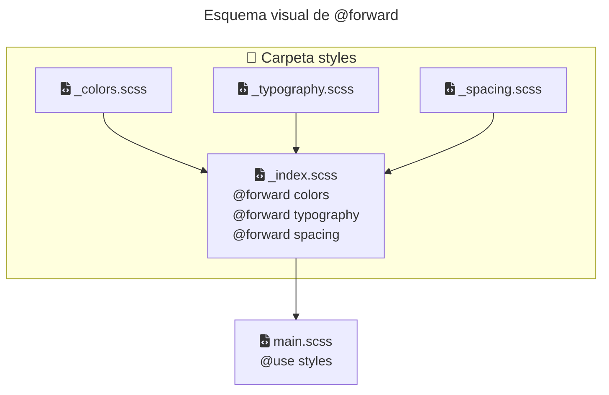

La directiva `@forward` sirve para **reexportar** variables, mixins y funciones desde un archivo Sass hacia otros.
No genera CSS por sí sola y **no aplica estilos automáticamente**.

## El problema que resuelve

Antes, con `@import`, todo se cargaba de forma global.
Eso causaba:

* nombres pisados
* dependencias ocultas
* archivos difíciles de mantener

`@forward` evita eso haciendo que **todo sea explícito**.

## Ejemplo básico

Para la siguiente estructura de archivos:



### Uso desde otro archivo



## @forward no es @use

* `@use` es para consumir cosas
* `@forward` es para exponer cosas

Normalmente:

* `@forward` se usa en archivos `index.scss`
* `@use` se usa en los estilos reales

## Controlar qué se expone

__Mostrar solo lo necesario__:

```scss
@forward "colors" show $primary;
```

Solo `$primary` queda disponible.


__Ocultar cosas internas__:

```scss
@forward "colors" hide $secondary;
```
  
Todo menos `$secondary`.

## Regla importante

`@forward` **no hace que puedas usar las cosas dentro del mismo archivo**. Su propósito principal es **reexportar variables, mixins o funciones para que otros archivos puedan usarlas sin necesidad de importar cada archivo por separado**.

Por eso, **su uso está especialmente pensado para archivos `_index.scss`**, donde solo se reexportan cosas y no se añaden reglas adicionales. Así, otros archivos pueden usar todo lo que reexporta `_index.scss` con un solo `@use`.

## Patrón recomendado

```scss
@forward "colors";
@forward "typography";
@forward "spacing";
```
{:file='styles/_index.scss'}

```scss
@use "styles";
```
{:file='main.scss'}

Un solo punto de entrada, ordenado y mantenible.





## Resumen rápido

* `@forward` expone
* `@use` consume
* No hay variables globales
* Todo tiene namespace
* Ideal para librerías y proyectos grandes