Esta extensión permite convertir cualquier archivo escrito en Markdown (`.md`) en un documento PDF, directamente desde el editor. Excelente para crear documentación profesional, informes técnicos, apuntes académicos, etc. Funciona con atajos de teclado o comandos de la paleta, facilitando la generación de PDFs y también nos da la posibilidad de exportar a otros formatos como __html__, __png__, etc.

## Instalación

1. Abre Visual Studio Code
2. Cambia a Extensiones
3. Busca: `Markdown PDF` (autor: yzane)


O puedes abrir su página en el Marketplace y añadirlo:



<br/>

__No requiere configuración extra__ para empezar a usarla.


## Ventajas frente a otras alternativas

| Opción           | Ventaja                          |
| ---------------- | -------------------------------- |
| Pandoc           | Muy potente, pero más complejo   |
| Servicios online | Rápidos, pero poco seguros       |
| Markdown PDF     | Integrado, simple y configurable |

Markdown PDF destaca por su **equilibrio entre simplicidad y control**.

> __Exportación sin conexión__:  
> Todo el proceso ocurre **localmente**, sin subir archivos a la nube. Ideal para __proteger información sensible__ y __trabajo offline__.
{:.prompt-tip}

## Cómo usar Markdown PDF

Abre una carpeta en tu equipo, ábrela con **Visual Studio Code** y crea un archivo con extensión `.md`. Luego, sigue estos pasos:

1. Haz **clic derecho** sobre el archivo y selecciona una de las siguientes opciones:
   * `Markdown PDF: Export (pdf)`
   * `Markdown PDF: Export (html)`
   * `Markdown PDF: Export (png)`
   * `Markdown PDF: Export (jpeg)`
2. Espera a que finalice el proceso de exportación.
3. El archivo generado (por ejemplo, el PDF) se creará en el **mismo directorio** que el archivo Markdown original.


## Características principales

### 1. Soporte completo de Markdown

Markdown PDF es compatible con la sintaxis estándar de Markdown y respeta la estructura del documento al exportarlo. Se recomienda saber la sintaxis de Markdown, aquí te dejo una referencia rápida a consultar la guía oficial de **CommonMark**: [https://commonmark.org/help/](https://commonmark.org/help/){:target="_blank"}

Markdown PDF respeta:

* Encabezados (`#`, `##`, `###`)
* Listas ordenadas y no ordenadas
* Citas (`>`)
* Enlaces e imágenes
* Tablas
* Bloques de código
* Énfasis (`**negrita**`, `*cursiva*`)

### 2. Soporte para bloques de código

Los bloques de código se renderizan correctamente:

````markdown
```js
function hola() {
  console.log("Hola Markdown PDF");
}
```
````
{:.nolineno}

Incluye:
- Tipografía monoespaciada
- Fondo diferenciado
- Saltos de línea correctos


### 3. Soporte para Mermaid (diagramas)

Si usas **Mermaid**, Markdown PDF puede renderizar diagramas correctamente. Sin embargo, **en versiones recientes de Mermaid los diagramas pueden no generarse correctamente** al exportar a PDF.

Una forma de solucionarlo es cambiar la versión de la librería en el servidor de mermaid en el archivo de configuración de VS Code (`settings.json`):

```js
{
  // "markdown-pdf.mermaidServer": "https://unpkg.com/mermaid/dist/mermaid.min.js",
  "markdown-pdf.mermaidServer": "https://unpkg.com/mermaid@9.4.3/dist/mermaid.min.js",
}
```
{:file="settings.json" .nolineno }


#### 3.1 Diagrama de flujo (Flowchart)



````html
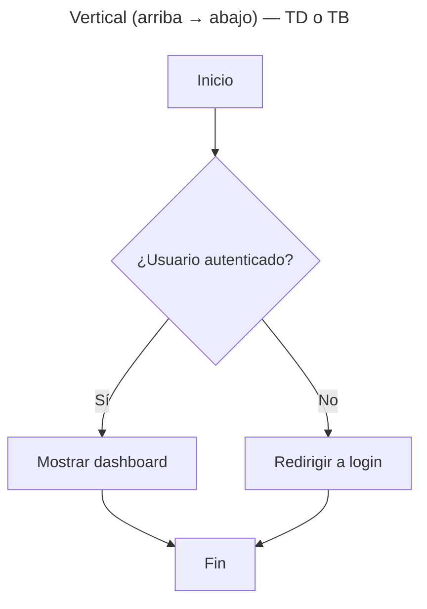

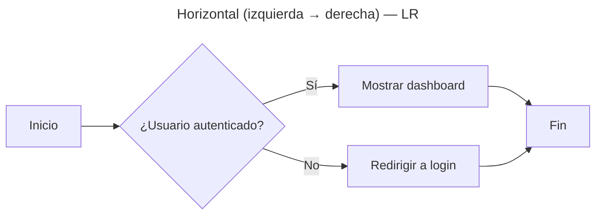

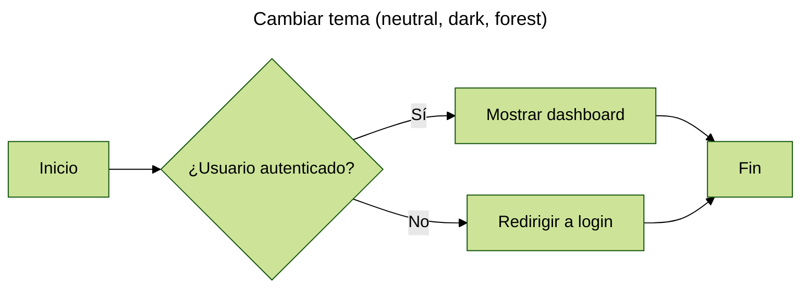

<h3 style="text-align:center;">Centrado</h3>

<div class="mermaid" align="center">
flowchart TD
    A[Inicio] --> B{"¿Usuario autenticado?"}
    B -- Sí --> C[Mostrar dashboard]
    B -- No --> D[Redirigir a login]
    C --> E[Fin]
    D --> E
</div>
````
{:file="flowchart.md"}






#### 3.2. Diagrama de secuencia



````html
<style>
    pre:last-child {
        background: #000;
    }
</style>

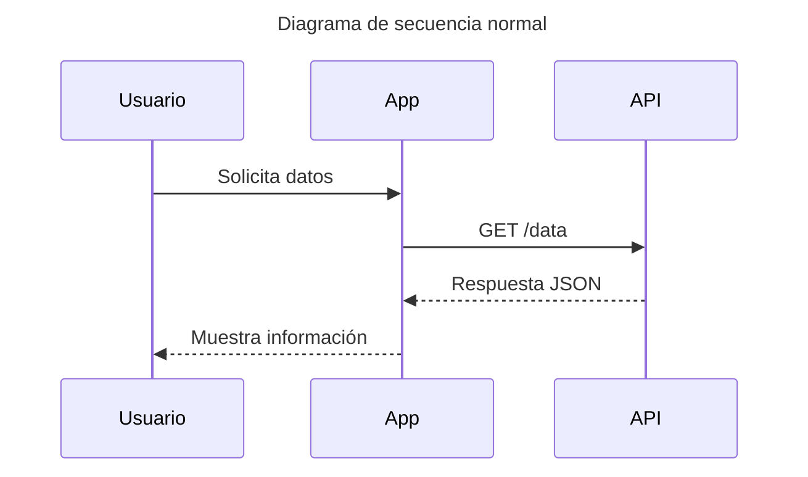

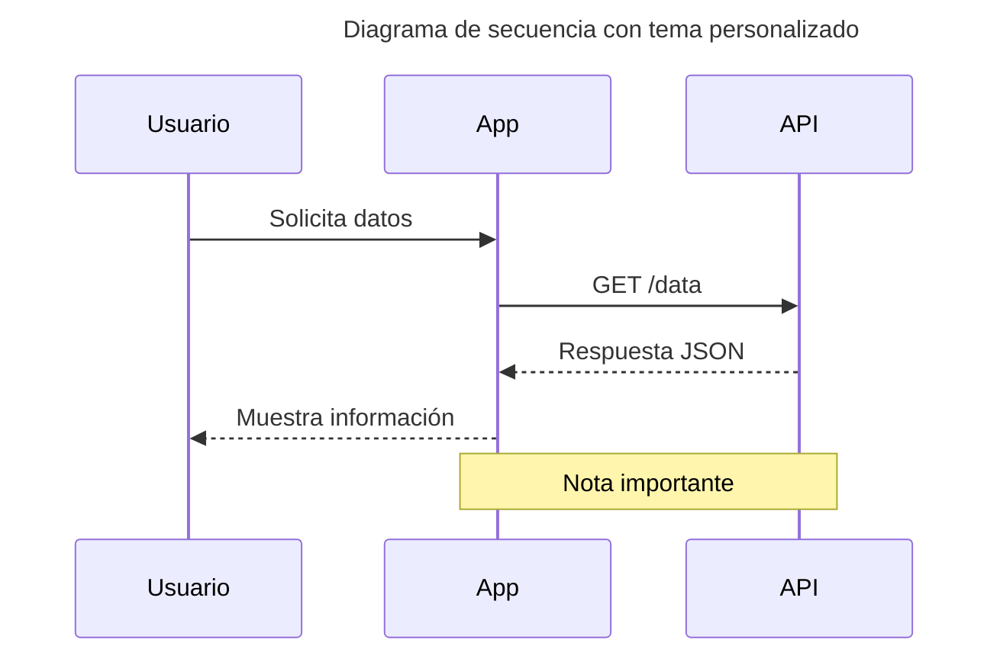

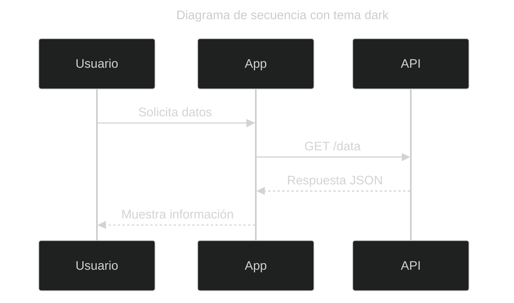
````
{:file="sequence.md"}






#### 3.3 Diagrama de clases



````
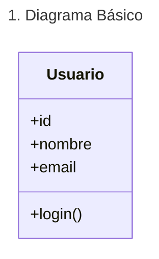

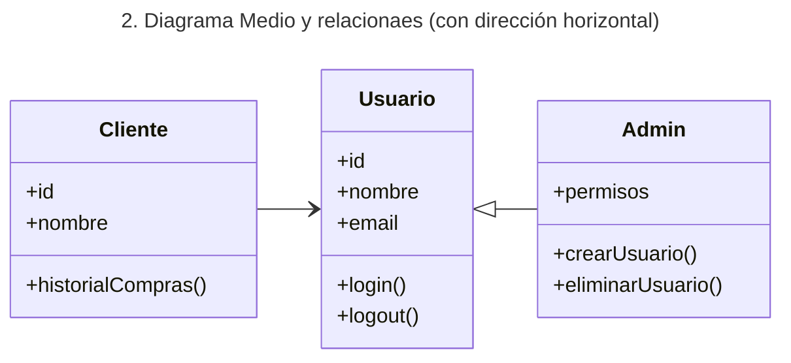

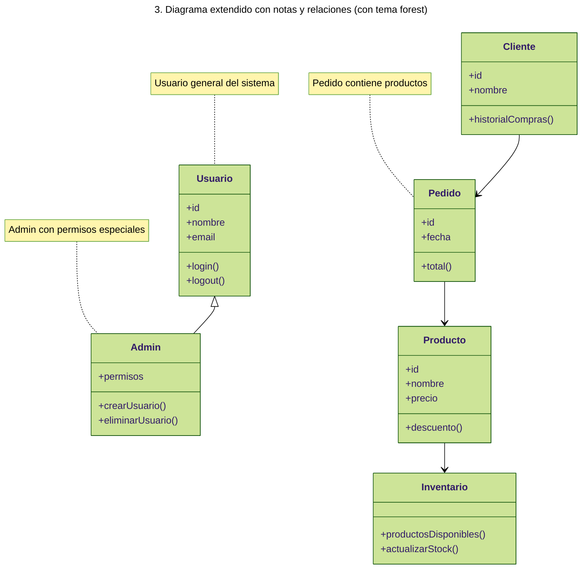
````
{:file="classDiagram.md"}






#### 3.4 Diagrama de estados



````
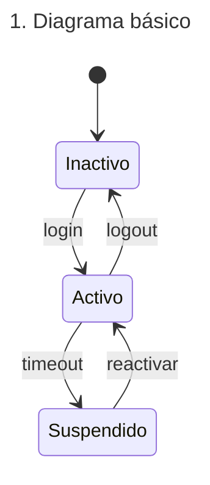

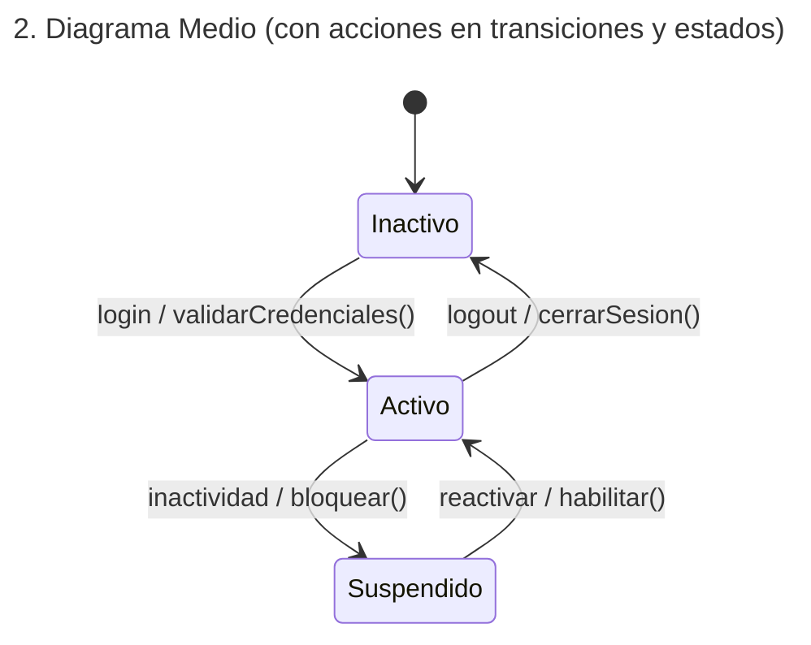

<div class="page">

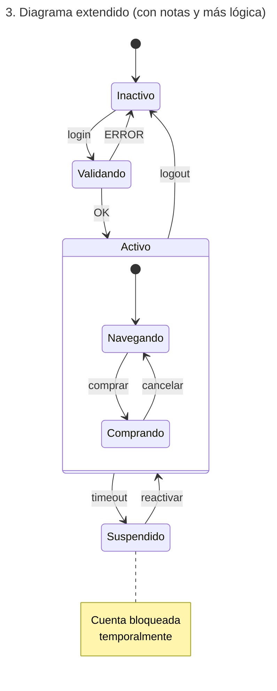
````
{:file="stateDiagram.md"}






#### 3.5 Diagrama ER (Entidad–Relación)




````
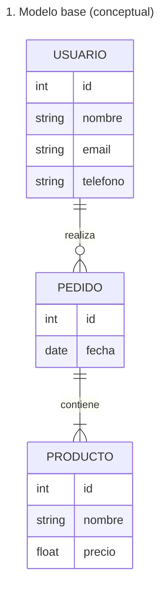

<div class="page">

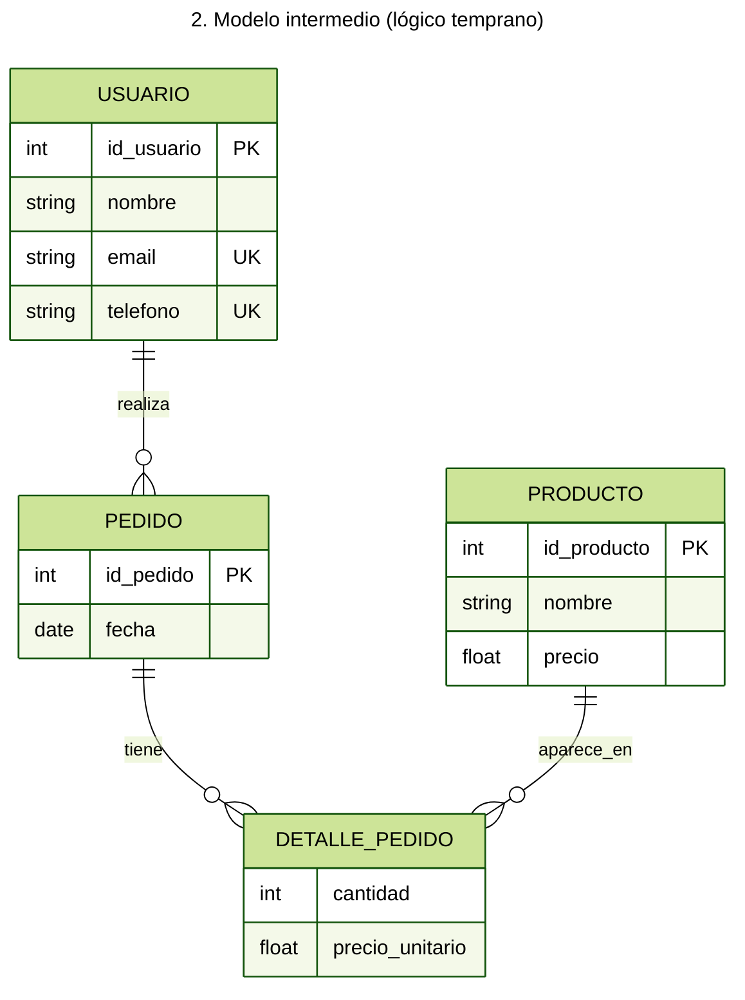

<div class="page">


<h3>3. Modelo final (lógico / relacional)</h3>

<pre class="mermaid" style="display: flex; justify-content: center; background: transparent; border: none">
%%{init: {'theme': 'neutral'}}%%
erDiagram
    USUARIO ||--o{ PEDIDO : genera
    USUARIO ||--|| ROL : tiene
    PEDIDO ||--o{ DETALLE_PEDIDO : incluye
    PRODUCTO ||--o{ DETALLE_PEDIDO : aparece_en

    USUARIO {
        int id_usuario PK
        string nombre
        string email UK
        int id_rol FK
    }

    ROL {
        int id_rol PK
        string descripcion UK
    }

    PEDIDO {
        int id_pedido PK
        date fecha
        int id_usuario FK
    }

    PRODUCTO {
        int id_producto PK
        string nombre
        float precio
    }

    DETALLE_PEDIDO {
        int id_pedido FK
        int id_producto FK
        int cantidad
        float precio_unitario
    }
</pre>
````
{:file="erDiagram.md"}







#### 3.6 Diagrama de Gantt



````
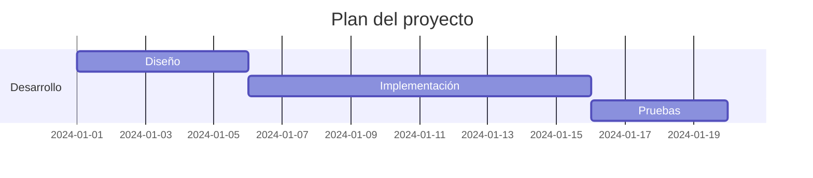

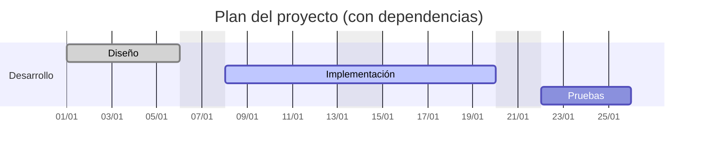

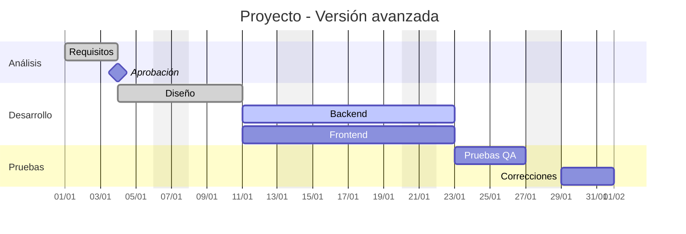
````
{:file="ganttDiagram.md"}







### 4. Uso de CSS personalizado

Una de sus mejores características es la posibilidad de **inyectar CSS propio** para personalizar el PDF.

En la configuración de VS Code (`settings.json`):

```json
"markdown-pdf.styles": [
  "styles/pdf.css"
]
```
{:file="settings.json" .nolineno}

Ejemplos de personalización:

* Tipografía corporativa
* Márgenes
* Colores
* Estilo de encabezados
* Apariencia de tablas



El resultado, sería el siguiente:



### 5. Encabezados y pies de página

Puedes definir **header y footer** para el PDF:

```json
{
    "markdown-pdf.headerTemplate": "<div style='font-size:10px;'>Mi documento</div>",
    "markdown-pdf.footerTemplate": "<div style='font-size:10px;'>Página <span class='pageNumber'></span></div>"
}
```
{:file="settings.json" .nolineno}

Por ejemplo:


````markdown
# Prueba de Header y Footer

Este documento sirve únicamente para **verificar que el header y footer de página**.

El header debería mostrar:
* **@mcherrera** alineado a la **izquierda**
* **El título del documento** alineado a la **derecha**

El footer debería mostrar:
- [mcherrera.dev](https://mcherrera.dev) a la izquierda
- **Número de página** al centro

Puedes repetir este texto varias veces para ver cómo funciona en varias páginas:

Lorem ipsum dolor sit amet, consectetur adipiscing elit. Vestibulum nec varius dui, ac sagittis metus. Sed sit amet lectus a erat blandit sodales. Aenean eget nisl nec urna malesuada tristique. Nullam pulvinar eros sit amet arcu convallis, nec feugiat ligula sagittis.

Lorem ipsum dolor sit amet, consectetur adipiscing elit. Vestibulum nec varius dui, ac sagittis metus. Sed sit amet lectus a erat blandit sodales. Aenean eget nisl nec urna malesuada tristique. Nullam pulvinar eros sit amet arcu convallis, nec feugiat ligula sagittis.

<div class="page"></div>

# Segunda página

Así podemos ver que tanto el encabezado como el pie de página se mantienen correctamente en todas las páginas.
````
{:file="header-and-footer.md"}


```json
{
    "markdown-pdf.format": "A4",
    "markdown-pdf.margin.top": "2cm",
    "markdown-pdf.margin.bottom": "2cm",
    "markdown-pdf.headerTemplate": "<div style=\"font-size: 9px; margin-left: 1cm;\"> @mcherrera</div> <div style=\"font-size: 9px; margin-left: auto; margin-right: 1cm; \"><span class='title'></span></div>",
    "markdown-pdf.footerTemplate": "<div style='width:100%; font-size:10px; padding: 0 1cm'><a href='https://mcherrera.dev' style='float:left; text-decoration:none; color:inherit;'>mcherrera.dev</a><span style='display:block; text-align:center;'>Página <span class='pageNumber'></span></span></div>"
}
```
{:file="settings.json" .nolineno}






### 6. Compatibilidad con imágenes locales y remotas

Markdown PDF maneja bien:

* Imágenes locales (`./images/imagen.png`)
* Imágenes remotas (`https://...`)
* Escalado automático
* Alineación

Ejemplo:



````markdown
# Prueba de imágenes

Markdown PDF maneja bien:

- Imágenes locales
- Imágenes remotas
- Escalado automático
- Alineación

## Imagen local (ruta relativa)


## Imagen local con tamaño controlado


## Imagen remota


## Imagen remota centrada

<p align="center">
  
</p>

## Imagen alineada a la derecha

<p align="right">
  
</p>
````
{: file="test-imagenes.md" .nolineno }







### 7. Soporte extendido basado en markdown-it

Markdown PDF utiliza **`markdown-it`**, lo que permite usar varias funcionalidades avanzadas de Markdown:

#### 7.1 Contenedores (markdown-it-container)



````markdown
::: note
Este es un bloque de nota
:::

::: warning
Este es un bloque de advertencia
:::
````
{:.nolineno}


```html
<div class="note">
<p>Este es un bloque de nota</p>
</div>
<div class="warning">
<p>Este es un bloque de advertencia</p>
</div>
```
{:.nolineno}



Se pueden estilizar con CSS.

#### 7.2 HTML embebido

```markdown
<p align="center">
  
</p>
```

Permite centrar imágenes, usar `<div>` y otros elementos HTML.

#### 7.3 Checkboxes (markdown-it-checkbox)

Extensión para habilitar **checkboxes** en Markdown al generar el PDF.



```md
- [x] Tarea completada
- [ ] Tarea pendiente
```
{:.nolineno}


```html
<ul>
<li><input type="checkbox" id="checkbox0" checked="true"><label for="checkbox0">Tarea completada</label></li>
<li><input type="checkbox" id="checkbox1"><label for="checkbox1">Tarea pendiente</label></li>
</ul>
```
{:.nolineno}



#### 7.4 Includes (markdown-it-include)

**Markdown PDF** ya incluye soporte para **`markdown-it-include`**.

Este plugin permite **insertar el contenido de otros archivos Markdown** dentro de un documento principal usando una sintaxis especial.

La inclusión se realiza anteponiendo dos puntos (`:`) a un enlace Markdown:

```md
:[Texto descriptivo](ruta/al/archivo.md)
```
{:.nolineno}

* El archivo indicado se **inserta directamente** en el documento
* La ruta es **relativa al archivo actual**

__Ejemplo básico__:



Al exportar a PDF, la introducción y el diagrama se renderizan **como parte del documento**, no como un enlace. Por ejemplo, el siguiente PDF sería el resultado:



<br/>
__Consideraciones__:

- Solo funciona con archivos `.md`
- El contenido incluido **hereda estilos y numeración**
- Ideal para separar capítulos, diagramas y anexos
- Facilita mantener documentos largos sin repetir contenido

#### 7.5 PlantUML (markdown-it-plantuml)

PlantUML permite crear diagramas a partir de texto plano, facilitando su mantenimiento y control de versiones dentro de la documentación técnica. Mediante [**`markdown-it-plantuml`**](https://github.com/gmunguia/markdown-it-plantuml){:target='_blank'}, los diagramas definidos en bloques entre las directivas `@startuml` y `@enduml` se renderizan automáticamente al exportar a PDF.

> Recuerda definir las directivas de inicio y final; de lo contrario, el diagrama no se renderizará.
> ```
> @startuml
> ...render...
> @enduml
> ```
> {:file="demo.uml"}
{: .prompt-info }

__Ejemplo básico__:



```
## Ejemplo 1 – Estilo visual predeterminado

@startuml
class Usuario {
  id: int
  nombre: string
  email: string
}

class Pedido {
  id: int
  fecha: date
}

Usuario "1" --> "0..*" Pedido
@enduml

## Ejemplo 2 – Estilo visual personalizado

@startuml
skinparam classBackgroundColor #EEF2FF
skinparam classBorderColor #1E40AF
skinparam classFontColor #1F2937
skinparam classFontSize 12

class Producto {
  +id: int
  +nombre: string
  +precio: float
}

class Categoria {
  +id: int
  +nombre: string
}

Categoria "1" --> "0..*" Producto : agrupa
@enduml


## Ejemplo 3 – Paquetes y visibilidad

@startuml
left to right direction

skinparam packageStyle rectangle

package "Dominio" {
  class Usuario {
    +id: int
    +nombre: string
  }

  class Rol {
    +id: int
    +nombre: string
  }
}

package "Autenticación" {
  class AuthService {
    +login()
    +logout()
  }
}

Usuario "*" -- "*" Rol
AuthService ..> Usuario : valida
@enduml
```
{:file="markdown-it-plantuml.md"}






## Ejemplos avanzados

### Personalizar diseño PDF

Algo realmente destacable de esta extensión es que permite personalizar el estilo del PDF usando CSS. Esto significa que puedes crear tu propio diseño, ajustando tipografías, colores, márgenes, tamaños de letra, etc.



> Para ver más opciones de los estilos y cómo se interpretan las rutas revisalo [aquí](https://marketplace.visualstudio.com/items?itemName=yzane.markdown-pdf#markdown-pdf.styles){:target='_blank'}
{: .prompt-tip }

A continuación, puedes observar un ejemplo de cómo se vería el documento final aplicando estilos CSS:



### Diagramas con PlantUML

A continuación, puedes ver cómo queda el PDF final usando algunos diagramas con PlantUML que diseñé:



### Usar Emojis

Los emojis se pueden usar dentro de los documentos, pero hay algunos detalles a tener en cuenta. Por ejemplo, si escribes `:smile:` o pegas directamente un emoji como 😀, al exportar el archivo a PDF **el resultado no siempre será el mismo**.

* Los **shortcodes** (`:smile:`) son procesados por la extensión y se convierten en imágenes al generar el PDF, por lo que siempre se ven correctamente.
* Los emojis pegados directamente (😀) sí se muestran, pero dependen de la **fuente** que use el generador. Si la fuente no los soporta, pueden aparecer en **blanco y negro** o incluso como cuadros vacíos.

A continuación, puedes ver cómo queda el documento final usando emojis con **shortcodes**:


